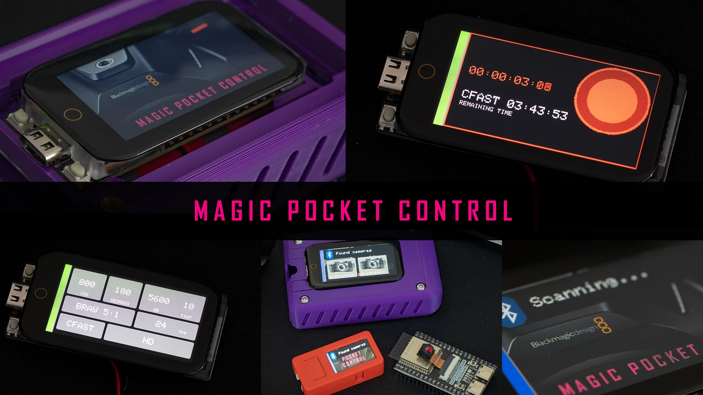
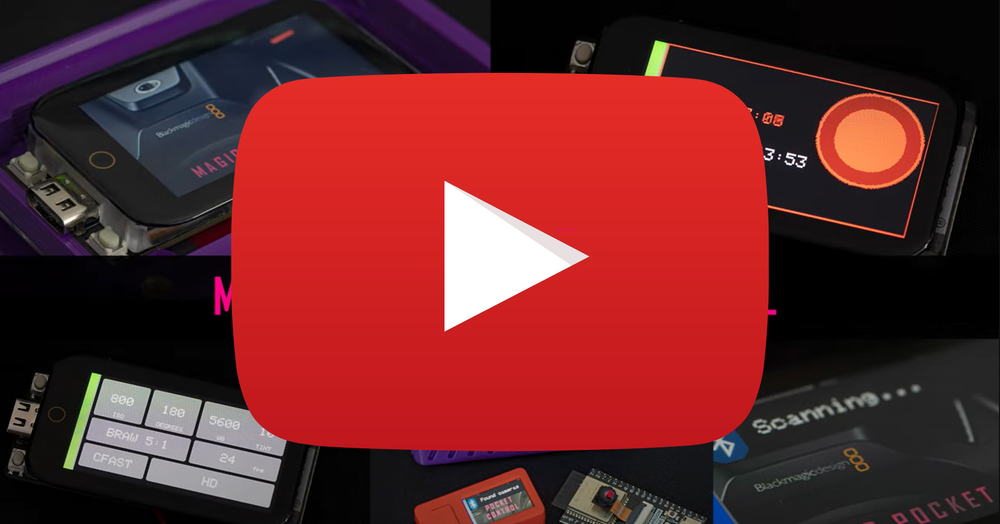
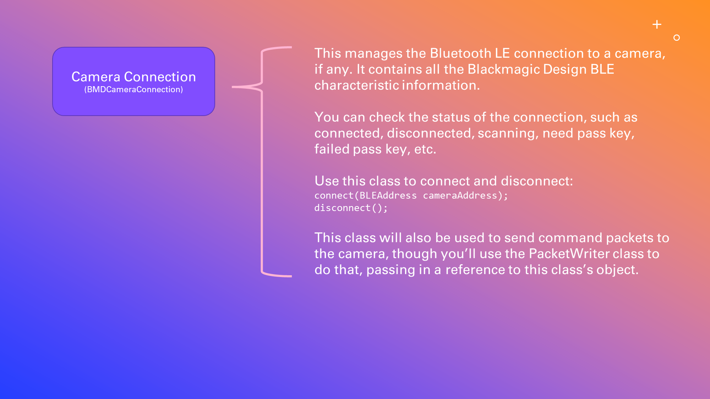
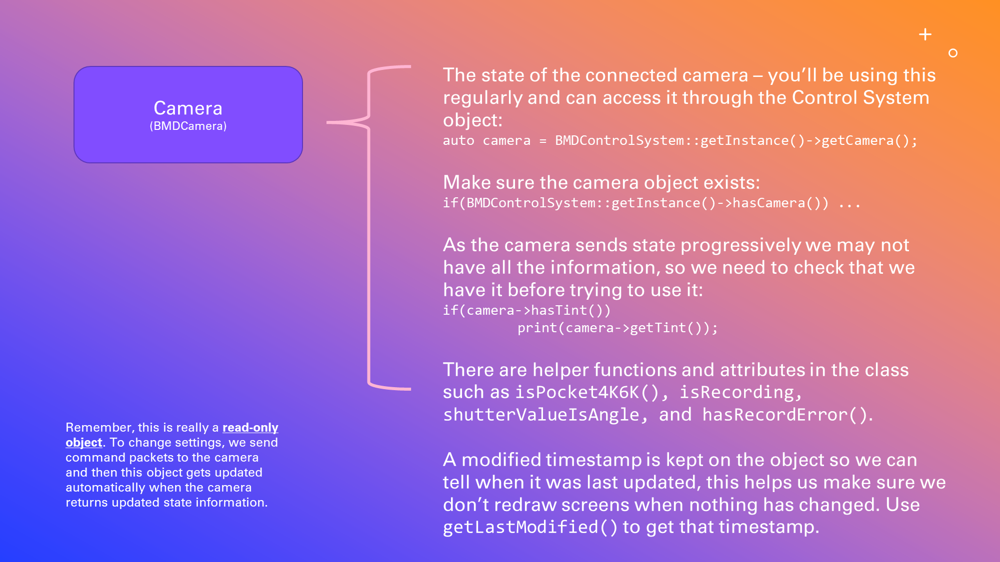
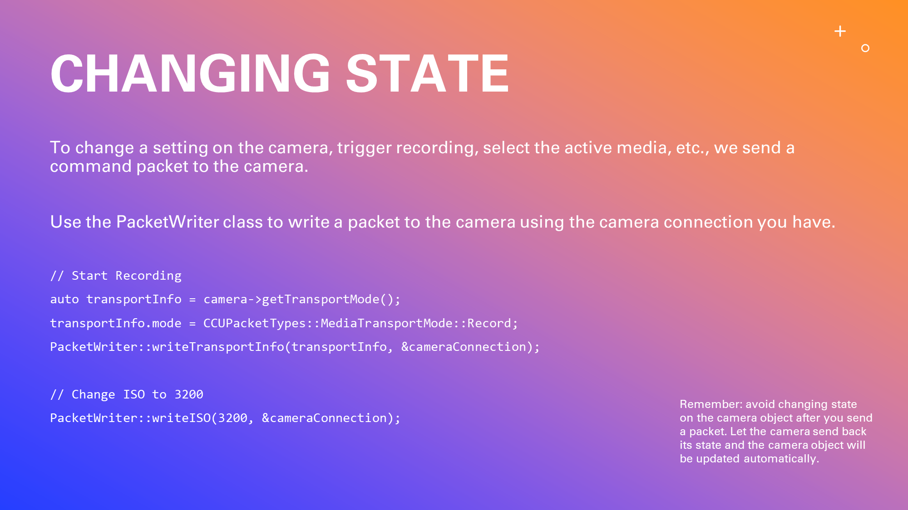
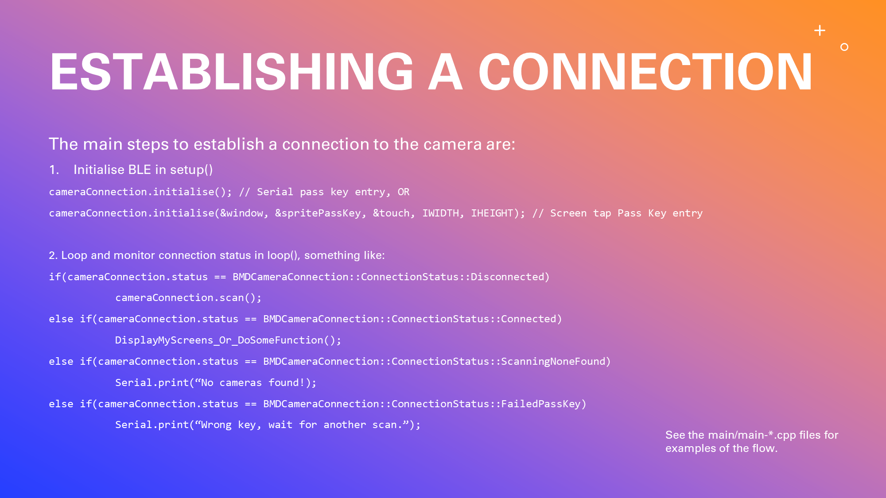
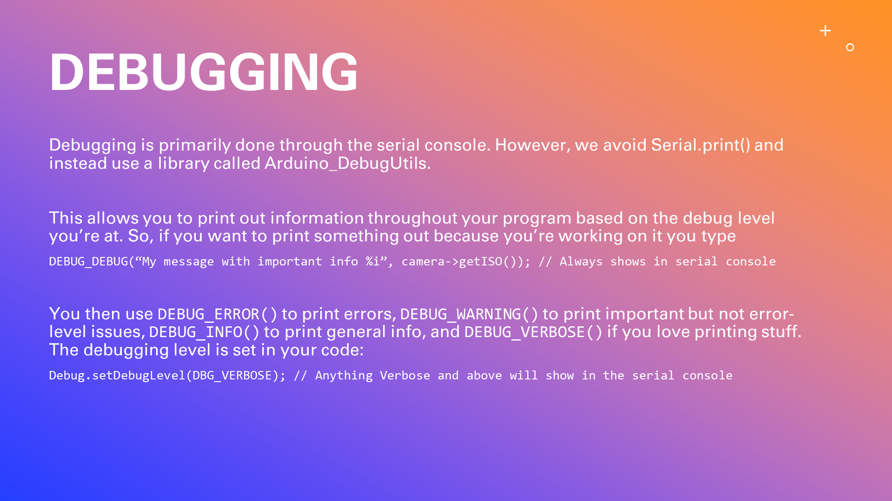

# :movie_camera: Magic Pocket Control for ESP32 devices
Blackmagic Design camera control on a LILYGO T-Display-S3, M5Stack M5CoreS3 :new:, M5Stack M5StickC Plus, Freenove ESP32-S3-WROOM, or (hopefully) any other ESP32 device.

Designed for the Pocket 4K, Pocket 6K/G2/Pro, USRA G2 4.6K, URSA 12K.

Coding is in C++ and setup for development in Visual Studio Code with the PlatformIO extension.

*NOTE*: If you're using Mac or Linux and recently cloned the repository and were not able to get it running then please try again as all backslashes in the #includes have been changed to forward slashes.



Video with demos (opens YouTube):

[](https://youtu.be/6xJVSfzSDwQ)

[](https://www.gnu.org/licenses/gpl-3.0)

:star: How about a Star?

# What can it do?
The key features are:
- Connect to the cameras wirelessly over Bluetooth LE
- Detect multiple cameras to allow you to select the camera to connect to, if multiple are available
- Entry of the Bluetooth connection code (6 digit pin) through a touchscreen numpad (LILYGO T-Display-S3)
- Entry of the Bluetooth connection code (6 digit pin) through the serial console (when you don't have touch-screen or keypad)
- Multiple screens that can be viewed by swiping left and right (LILYGO T-Display-S3)
- Screens and functionality (LILYGO T-Display-S3)
    - Dashboard: View the ISO, Shutter Speed, White Balance/Tint, Codec, FPS, active media device, and resolution
    - Recording: Start and Stop recording, shows timecode and the remaining time left on the active media
    - ISO: Change ISO
- Read and write the many settings of the camera (Record Start & Stop, ISO, Shutter Speed / Angle, White Balance, Tint, Codec, Resolution, FPS, Off-speed Recording, Media available and time remaining, Slate, Project Name, Lens Data)
- Accept setting changes through serial text (e.g. "(ISO:4000)" sent over serial will update the ISO to 4000). Similarly, it can output settings through serial so your applications can synchronise settings with the camera(s)

# Some visuals
[I'm working on them! :running: :camera: ]

# What can you do?
I hope you find the functionality useful and it would be great if you could contribute your improvements, suggestions, or general feedback to the project!

# Do you use TouchDesigner?
If you're a TouchDesigner user, check out nelsoniso's [repository here](https://github.com/nelsoniso/BlackMagicCamera-Touchdesigner-ESP32) which utilises the serial output of this project to update TouchDesigner in real-time and allow you to control the settings of the camera from TouchDesigner, it's very cool.

# Has it been tested?
It needs to be thoroughly tested and even though they do contain fairly basic functionality, there's still unknowns around connection longevity, camera firmware changes, known issues in camera firmware, and the position of the sun in the sky.

Here's the state of cameras and firmware.

| Camera | Firmware | Status |
| :---: | :---: | :---: |
| Pocket 4K | 7.9.1 | $\color{green}{\textsf{OK}}$ $\color{orange}{\textsf{ (BRAW <-> ProRes change firmware bug)}}$ |
| Pocket 4K | 8.1 | $\color{green}{\textsf{OK}}$ $\color{orange}{\textsf{ (See Known Bugs below)}}$ |
| Pocket 6K | 7.9.1 | $\color{green}{\textsf{OK}}$ $\color{orange}{\textsf{ (BRAW <-> ProRes change firmware bug)}}$ |
| Pocket 6K | 8.1 | $\color{green}{\textsf{OK}}$ $\color{orange}{\textsf{ (See Known Bugs below)}}$ |
| Pocket 6K G2 | ... | Not Tested |
| Pocket 6K Pro | ... | Not Tested |
| URSA Mini Pro 4.6K G2 | ... | Not Tested |
| URSA Mini Pro 12K | ... | Not Tested |
| URSA Mini Pro 12K OLPF | ... | Not Tested |

If you're in Sydney, Australia, and would be able to lend me a camera I haven't tested for a day to test so we know it works, that would be amazing.

# Known bugs
- Changing Codecs between BRAW and ProRes on Camera Firmware 7.9.1 on Pocket cameras not functioning
- Changing Codecs between BRAW and ProRes on Camera Firmware 8.1 on Pocket 4K not switching until you've manually changed them once on the camera
- Changing Codecs between BRAW and ProRes on Camera Firmware 8.1 on Pocket 6K not switching (even if you manually change them beforehand)
- Changing resolutions when using ProRes on Camera Firmware 8.1 on Pocket cameras not functioning in all cases (ProRes 4K DCI to UHD or HD, may require you to manually change them once on the camera)

# Why?
My primary objective was to convert a Windows-based application I had for controlling my cameras to a small portable device.

These devices are so small, portable, and don't require much power.

I'm opening up to the community who may find this useful or would like to contribute to it. Any contribution you make will be appreciated!

# Why did I choose the LILYGO T-Display-S3 Touch version to program for?
I found this device had all the necessary components needed to connect and interact with the cameras:
- Connect over Bluetooth LE
- Touchscreen to enter the connection code (which is a challenge with screen-less touch-less devices)
- Touchscreen to support gestures (swiping left and right to change screens)
- Nice bright and colourful 320 x 170 display
- Powered over USB-C or a battery
- Cheap! ~$22USD (or $40AUD for us Aussies)

# What ESP32 devices are support?
Hopefully all of them are supported and I have a few that I'm developing for to check they work - LILYGO T-Display-S3, M5Stack M5CoreS3, M5Stack M5StickC Plus, Freenove ESP32-S3-WROOM.

It would be great if you could let the community know what ESP32 device you have and whether it works and I'll update this note.

# Can't I use a mobile/tablet app?
Yes, indeed you can! Alternatively, this is designed as a lightweight small device that allows you to see and control basic functions of your camera. It can act as a dedicated device for each camera you have, or simply to avoid touching the camera to control it (when it's on a gimbal, mounted somewhere, or in a moving car :) ).

# How do I run this?
You will need the following:
- An ESP32 device
    - If you want the touch-screen functionality try the LILYGO T-Display-S3 **Touch version** [Buy here, ~$22USD](https://www.lilygo.cc/products/t-display-s3?variant=42589373268149)
        - *Make sure to get the Touch version!*
    - You can also try the M5Stack M5CoreS3 which comes with an in-built battery [Buy here, ~60USD](https://shop.m5stack.com/products/m5stack-cores3-esp32s3-lotdevelopment-kit)
- Visual Studio Code (VS Code) [Free, download here](https://code.visualstudio.com/download)
- The PlatformIO extension within VS Code (see below on how to configure PlatformIO for this device)
- A Blackmagic Design camera (Pocket 4K/6K/6K G2/6K Pro, URSA 4.6K G2, URSA 12K)

# Configuring PlatformIO
It is important that you use PlatformIO if you want to use the repository as it is. Feel free to use the libraries in your own project if you don't want to develop for the repository. The following notes are based on using this repository

**platformio.ini** - This file tells PlatformIO what boards you have and which "main-[board name].cpp" file to use. In the *src/main/* folder you'll see a set of main cpp files, each one is the program that relates to the board. When you compile and upload the program to your board PlatformIO uses the main file that ***matches the name*** of the board you have chosen (in the bottom taskbar of Visual Studio Code you can choose the *environment* you are using which represents the board. For example, programming for the M5Stack M5StickC Plus will be done in the *src/main/main-m5stick-c.cpp* file because that has the name related to the environment chosen when we select "env:m5stick-c".

If you want to add your own board and program for it, do so like this:
1. Open platformio.ini and check if the board already exists, if so you're good to go.
2. If not, go to the [PlatformIO boards page](https://docs.platformio.org/en/latest/boards/index.html) and find your board. If you don't find it you'll need to find something as close as possible.
3. Click on the board name and it will open up its own page
4. Look for the ID of the board. For example, for the [Adafruit ItsyBitsy ESP32](https://docs.platformio.org/en/latest/boards/espressif32/adafruit_itsybitsy_esp32.html) the ID is *adafruit_itsybitsy_esp32*.
5. Add the following to the end of the **platformio.ini** file (putting in the ID of the board):
```
[env:adafruit_itsybitsy_esp32]
platform = espressif32
board = adafruit_itsybitsy_esp32
```
6. Save the file
7. Create a main source file under *src/main/* that has the ID of the board prefixed by "main-", e.g. "src/main/main-adafruit_itsybitsy_esp32.cpp"
8. Choose the new environment using the bottom environment bottom of Visual Studio Code
9. Click Build to compile (make sure your main file has at least "void setup()" and "void loop()" defined)


You will need to do the following to ensure that the TFT_eSPI library is configured for the LilyGO T-Display-S3 or any other device that you're using it for:
- The platformio.ini file within the project should already have TFT_eSPI as a library dependency. If you don't see TFT_eSPI under your ".pio\libdeps" folder > under the PlatformIO home page within Visual Studio Code, click on Libraries, search for TFT_eSPI. Click on it and then click on **Add to Project**, select your project and click **Add**. Proceed to the next point.
- Ensure you have uncommented the device line in the User_Setup_Select.h file (pio\build\libdeps\<device ID>\User_Setup_Select.h) for TFT_eSPI and also commented out the default line (around line 30). For example the T-Display-S3 line is around line 133 of the file.
- Similarly, if you don't have the "Arduino_DebugUtils" under your ".pio\libdeps" folder, add the "Arduino_DebugUtils" library to the project using the same method above.

# What can we do with these cameras?
See the Blackmagic Camera Control Developer Information document, [here](https://documents.blackmagicdesign.com/DeveloperManuals/BlackmagicCameraControl.pdf). It's not up-to-date and I've used the sample code, noted below, to update functionality. There remains other functionality not documented or in the code samples that has been worked out by the community.

I converted a lot of the Swift (Mac) code from Blackmagic Design's Cameras Code Samples, [Download here](https://www.blackmagicdesign.com/au/developer/product/camera)

# How does the program work?












# Thank you to...
- Blackmagic Design: For making affordable cameras and having a public protocol so we can interact with them
- Blackmagic Design Support: A big shoutout to Brendan at Blackmagic Design who helped troubleshoot the changing of Codecs, which was/is a known bug in the camera firmware. Thanks Brendan!
- BlueMagic32: A great project to control cameras with an ESP32. It provided a reference for the Bluetooth connection functionality. [https://github.com/schoolpost/BlueMagic32](https://github.com/schoolpost/BlueMagic32)
- LILYGO: For creating a cool product and having some code examples for it. [https://github.com/Xinyuan-LilyGO/T-Display-S3](https://github.com/Xinyuan-LilyGO/T-Display-S3)
- Volos Projects on YouTube: For having an entertaining set of videos on programming for the T-Display-S3. [T-Display-S3 Touch example](https://www.youtube.com/watch?v=qwRpdarrsQA)
- ChatGPT: The ability to convert code from Swift to C++ and to assist with C++ coding has saved days of programming. [https://chat.openai.com/](https://chat.openai.com/)

# FAQ
1. I'm not seeing anything on the screen?
    - Ensure you have uncommented the T-Display-S3 line (Around line 133) in the User_Setup_Select.h file for TFT_eSPI and also commented out the default line (Around line 30). In PlatformIO this is under libdeps\lilygo-t-display-s3\TFT_eSPI\TFT_eSPI.h
2. It's not working on my camera?
    - Ensure that you have Bluetooth turned on in the Setup menu on the camera
    - I have tested with the Pocket 4K and 6K (Original) - contact me if you are having trouble connecting to your camera.
    - The version of your firmware may need to be updated to the latest version so the protocol used is compatible with your camera.
3. How do I enter the PIN code to connect?
    - If you're using the LILYGO T-Display-S3 touch-version there's an on-screen numpad that appears when you're required to enter the code.
    - If you're using another ESP32, such as one without a screen, you can use the Serial console to enter the PIN code (see the M5Stick example code) for the first time you connect. Once you've done that you can unplug the device from your computer.
    - Once you've entered the code and connected succesfully both devices should remember each other for future connections, unless you clear the connections (as can be done on the Camera under the Bluetooth screen).

# I'm developing with the code but having trouble
See the programming and device tips document, [DevelopmentTips.md](DevelopmentTips.md).

# Disclaimer
* The use of this software is at your own risk. The creator of this software cannot be held liable.
* Using this software therefore is completely at your own risk.

# License
* GPL-3.0 license
* Converted Swift code from the Blackmagic Design Cameras Code Samples [Download here](https://www.blackmagicdesign.com/au/developer/product/camera)

# Contact me
You can contact me [here](mailto:mark@szeworks.com?subject=Magic%20Pocket%20Control%20on%20GitHub)

# :thumbsup: Thank you
Thanks for being part of the community! :sparkles:
